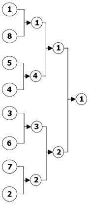
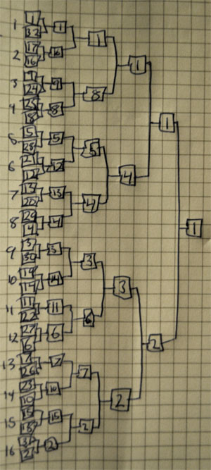
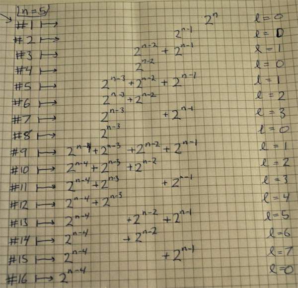

As a small effort in self-gratification after finishing uni, I looking into getting tournament scheduling possibilities into old clux.org. This turned out to take a little more mental effort than I expected. In particular, the problem of how to order seeds into the tournament bracket seemed almost a bit random. But after some hours on the couch with pen and paper and ivc to talk to, we found a sensible solution.


## Intro


The seeding is the correspondence $\{p \mid player\} \leftrightarrow \{1,2,\ldots,2^n\}$ where the number $k(p)\in\{1,2,\ldots,2^n\}$ is the estimated ranking for player $p$, i.e. player $p$ is expected to beat player $q$ if and only if $k(p) > k(q)$. The main problem is how to sort the players in the first round so that the the best players meet as late as possible (depending on their skill) in the tournament. The image below illustrates this for $2^3$ players. Formally we say:

## Defn
If there are $2^n$ players in the tournament then the ordering is _proper_ if the following hold.

* If the seeding is perfect (perfectly predicts the match outcomes) then only the $2^{n+1-k}$ top seeded players are left in round $k$.
* In each round the sum of the seeds in each match is constant.
*  The even seed in each match is placed at the bottom.



It's a bit much to assume that seedings are perfect, but the seeding above needs these three conditions to generate the analogous binary tree in $n$ dimensions, so we will use them. Besides, condition 2 does sort of provide some loose similar quality guarantee: the lower the sum, the most likely the better the games. The image above fills out what will happen in an eight player tournament if the seeding is perfect.

Knowing that it was these three properties that we wanted, we could at this point just generated the next level in the canonical tree successively until we got to the desired level to (i.e. make an arbitrarily large tournament system), but this would have been inefficient and a bit tedious (compared to finding patterns in numbers at paper, but that might be subjective). I tried first to find a system in the sequence $\{(1),(1,2),(1,4,3,2),(1,8,5,4,3,6,7,2),\ldots\}$, but this turned out to be very fruitless. Having ivc over, I explained the problem to him and we stared at it for a couple of hours (because that's just the kind of inviting friend I am).

Turns out the key was to look at the match numbers $1,\ldots,2^{n-1}$ by ordering from the top in the brackets. I.e. match 1 is 1 vs. 8, match 2 is 5 vs. 4 etc. The major clue here is that in a match number that is a power of two, the even numbered seed in that match is also a power of two. In fact match $2^k \mapsto 2^{n-k}$, so the hard part is interpolating this function for general match numbers.

The system becomes clear first when we look at a full 32 player tournament i.e. $n=5$. In the interests of fully testing out the $\LaTeX$, I would ideally write this out, but tables are a bit of a pain in TeX, and I have this paper anyway.



This is expanded uniquely using the three defined properties and the smaller bracket above. The match numbers in the first round are written on the left. Notice that the top players all follow diagonal paths when they reach vastly inferior players.



The system comes from decomposing the match number $i$ as $i=2^k + l$ where $k = \lfloor \log_2{i} \rfloor$. If we write the even seed as powers of two then they display a binary counting system going up between match numbers that are powers of two. In fact, it's the binary representation of $i-2l$ that is required, so let $c_j = bit_j (i-2l)$. We can then verify the final function (sending match number to the even seed in that match).

$$2^k + l \mapsto \begin{cases} 2^{n-k},& \text{if $l=0$} \newline 2^{n-k-1}+2^n \sum_{j=1} 2^{-j}c_j,& \text{if $0 < l < 2^k$.}\end{cases}$$


Pretty cool for something as seemingly as simple as a tournament system.

## Python code

```python
def even_seed_from_match_nr(i, n): # match_nr, log2(participants)
    #decompose i = 2^k + r where 0 <= r < 2^k
    k = int(math.floor(math.log(i,2)))
    r = i - (1 << k)

    if (r == 0): return 1 << n-k

    nr = bin(i - 2*r)[2:][::-1]
    return int(nr,2) << n-len(nr) | 1 << n-k-1
```

One of the crazier things I have written in python. And as such, it needs a few notes, especially on the non-zero r (denoted as l earlier in doc) case: `nr = binary(i-2*r)` reversed (remove leading 0b part of string first). Then shift `n-k` and add in leading term. However, nr should be k bits, so we need to shift more if not (when reversing leading become trailing) so must shift extra `len(nr)-k` bits. Without the compensation for extra zeroes the return wouldve looked like this: `return int(bin(i-2*r)[2:][::-1],2) << n-k | 1 << n-k-1`. Insane.
