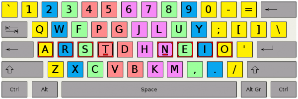

# Colemak

QWERTY sucks. You always learn it wrong, and it's optimized for not jamming your typewriters whilst typing English. Oh, I'm sorry, is that *not* how you type?

My brother started using [DVORAK](http://en.wikipedia.org/wiki/Dvorak_Simplified_Keyboard#Comparison_of_the_QWERTY_and_Dvorak_layouts), (a similarly crazy layout) which aimed to reduce the number of awkward finger movements using analysis of language and layout experimentations. My problem with DVORAK is that they moved important shortcut keys like X, C, W, Q, S and T so far away from left CTRL that the benefit disappeared. That was a deal-breaker.

Brothar was on the other hand taunting me with his DVORAK wpm (a huge improvement on his dyslexic QWERTY speed), and while I wanted to change, my attachment to passwords kept me out for a bit. Eventually, I figured out that you can bind Alt-Shift (in both Ubuntu and W7) to change back to QWERTY for passwords (because some of mine are ludicrously long and pattern based). Anyway, it was a triumph. Albeit hard initially, After two months, I caught up with my old QWERTY speed, but it feels much more effortless. Also, I get the added bonus of annoying everyone who wants to type on my computer to show off their skills. They will type in a few cool commands with their complete control of QWERTY, but it will of course come out as gibberish, soothing me greatly.

I may not know a whole lot about debugging C yet, but at least I can use this really annoying keyboard layout.

So, how good is it? Take the [2 minute typing test](http://hi-games.net/typing-test/). I used to get around 85 before the switch after years and years of use. It took me 2 months to tie that, and now, 2 years after the switch, I have crossed the 100 average mark - and all my fingers are in use!

It never caused me any problems except that my QWERTY speed is noticably worse (having to look down), but be warned, it takes a lot of time to get used to this. Mostly your hands need to unlearn QWERTY.

Colemak Progress:

- ~2 weeks:  60 wpm
- ~2 months: 80 wpm
- ~6 months: 90 wpm
- ~2 years: 100 wpm

Records: 102wpm on the hi-games 2 minute typing test, 120wpm on typeracer.
