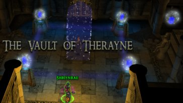
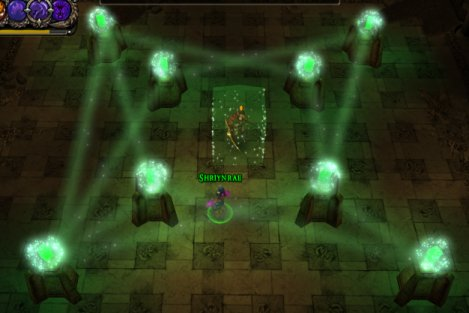
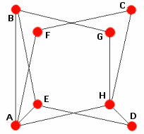
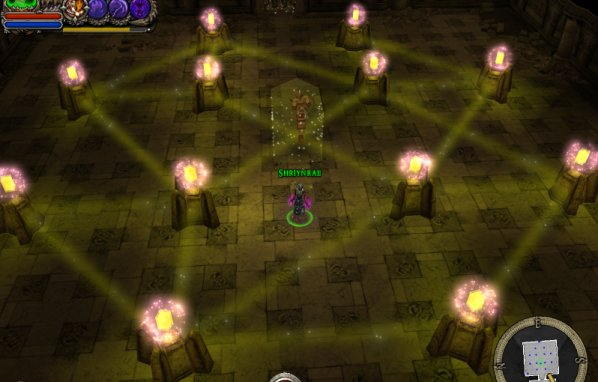
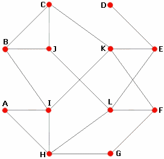
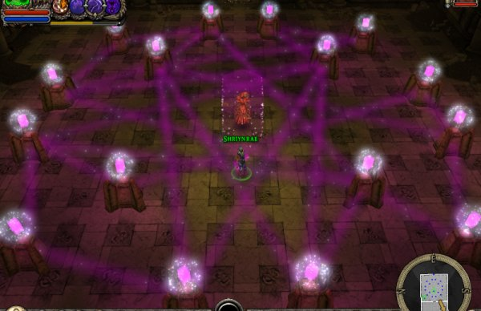
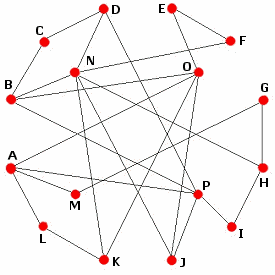

This is an easter egg for the Dungeon Siege 2 Broken World expansion.



After doing the first two rooms of the Treasure Hunt quest in part 2, you can take two additional puzzles of the same type, but these are ridiculously hard. If you made the second one, you have no doubt noticed that these are much trickier than the general lightning reflection puzzle in the original DS2. The third should be possible with  a manageable dose of trial and error - still too much for what's essentially a mindless hack'n slash game - but the last one is almost impossible. So I present the way to solve it - if patience is not your virtue - namely; mathematically. First three are just solutions that was just included for completeness, the method used is described in the last section.


## Square
Every node has an even amount of connections, so this solution is trivial; simply click each node once.

## Double square


Also quite easy, but here's the matrix solution (forgot the one I used, and needed to generalize the method for the larger polygons)
A,C,F,H (press those once, in whatever order)

## Octagon


just the solution here
B,E,G,I,J,K,L - in whatever order, the one found by trial and error
or from mathematica
B,C,D,G,I,K,L

## Dodecagon from hell


Every block must be inverted an odd number of times, and since inverting twice is the same as not doing anything, these operations are equivalent to addition mod 2.

Each row j in matrix V represents which lights are inverted by f(j).
For instance: f(A) inverts A, L, M, O, and P (as shown in the diagram), which is the first row in V.

```
V={{1, 0, 0, 0, 0, 0, 0, 0, 0, 0, 0, 1, 1, 0, 1, 1},
  {0, 1, 1, 0, 0, 0, 0, 0, 0, 0, 0, 0, 0, 1, 1, 1},
  {0, 1, 1, 1, 0, 0, 0, 0, 0, 0, 0, 0, 0, 0, 0, 0},
  {0, 0, 1, 1, 0, 0, 0, 0, 0, 0, 0, 0, 0, 1, 0, 1},
  {0, 0, 0, 0, 1, 1, 0, 0, 0, 0, 0, 0, 0, 0, 1, 0},
  {0, 0, 0, 0, 1, 1, 0, 0, 0, 0, 0, 0, 0, 1, 0, 0},
  {0, 0, 0, 0, 0, 0, 1, 1, 0, 0, 0, 0, 1, 0, 0, 0},
  {0, 0, 0, 0, 0, 0, 1, 1, 1, 0, 0, 0, 0, 1, 0, 0},
  {0, 0, 0, 0, 0, 0, 0, 1, 1, 0, 0, 0, 0, 0, 0, 1},
  {0, 0, 0, 0, 0, 0, 0, 0, 0, 1, 0, 0, 0, 1, 1, 1},
  {0, 0, 0, 0, 0, 0, 0, 0, 0, 0, 1, 1, 0, 1, 1, 0},
  {1, 0, 0, 0, 0, 0, 0, 0, 0, 0, 1, 1, 0, 0, 0, 0},
  {1, 0, 0, 0, 0, 0, 1, 0, 0, 0, 0, 0, 1, 0, 0, 0},
  {0, 1, 0, 1, 0, 1, 0, 1, 0, 1, 1, 0, 0, 1, 0, 0},
  {1, 1, 0, 0, 1, 0, 0, 0, 0, 1, 1, 0, 0, 0, 1, 0},
  {1, 1, 0, 1, 0, 0, 0, 0, 1, 1, 0, 0, 0, 0, 0, 1}}
```

Solving the equation (Vx={1,1,....1} ) mod 2 reveals how many times one must utilize f(j) to invert every light source.

```
i={1, 1, 1, 1, 1, 1, 1, 1, 1, 1, 1, 1, 1, 1, 1, 1}

LinearSolve[V,i, Modulus -> 2]
Answer: {0, 1, 0, 0, 1, 1, 1, 0, 1, 1, 1, 0, 0, 1, 1, 0}
```

in other words: **Solution: B,E,F,G,I,J,K,N,O**

Later on I recieved a solution from the developer himself:
B,C,D,E,G,K,P - which yields all odds when taking the dot product with V, so would work.
